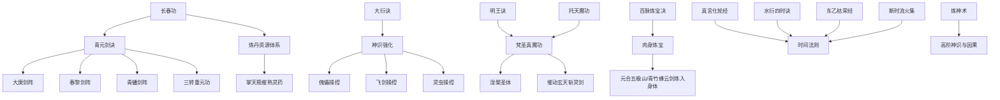

# 韩立功法成长树

韩立的功法路线体现“低资质 + 高资源转化 + 多体系并行”的成长方式。其路线不是单一路径升级，而是主修、辅助、神识、炼体、法则功法并行叠加。

## 阶段拆解

| 阶段 | 功法组合 | 解决问题 |
|---|---|---|
| 入门 | 长春功 + 基础法术 | 进入修仙体系，积累炼气基础 |
| 筑基/结丹 | 青元剑诀 + 三转重元功 + 丹药 | 主修路线、结丹概率、飞剑体系 |
| 元婴/化神 | 大衍诀 + 剑阵 + 傀儡 | 神识优势、多线操控、战术复杂度 |
| 灵界 | 梵圣真魔功 + 惊蛰诀 + 元磁神光 | 肉身、真灵血脉、五行/元磁体系 |
| 仙界 | 真言化轮经 + 炼神术 + 星元功 | 时间法则、神识因果、玄仙肉身 |

## 代价标注

| 功法 | 修炼代价 |
|---|---|
| 三转重元功 | 需要散功压缩真元，以换取结丹概率。 |
| 大衍诀 | 对神识要求高，适合操控傀儡、飞剑和灵虫。 |
| 炼神术 | 限制极重，强化神识的同时牵涉仙界因果。 |
| 魔道秘术 | 常伴随神魂、煞气或反噬风险。 |
