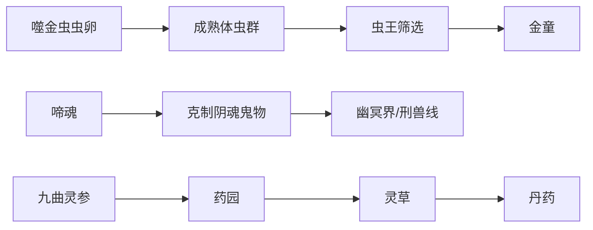

# 灵宠伙伴

韩立的成长不仅依靠功法法宝，也高度依赖灵宠、灵虫、器灵、草木精怪和傀儡伙伴。这些伙伴分别补足群攻、破邪、侦查、追踪、药园管理和高阶战力。

## 主要伙伴

| 伙伴 | 类型 | 核心能力 | 关系价值 |
|---|---|---|---|
| 噬金虫 -> 噬金虫王 -> 金童 | 灵虫 | 吞五金、破法宝、群攻、虫王进化 | 人界至仙界长期底牌 |
| 啼魂 | 灵兽/幽冥线 | 克制阴魂鬼物、吸魂啖鬼 | 对鬼道、炼尸和幽冥线极关键 |
| 银月/玲珑 | 器灵/妖族 | 器灵辅助、幻术、侦查 | 昆吾山、银月狼族、灵界妖族线 |
| 六翼霜蚣 | 冰属性灵虫 | 寒气、遁速、真龙血脉线索 | 培养与反叛体现灵宠控制风险 |
| 血玉蜘蛛 | 灵兽 | 蛛丝抵御乾蓝冰焰 | 虚天殿取鼎关键 |
| 豹麟兽 | 变异灵兽 | 风遁、追踪、战斗 | 灵界蛮荒任务与后期助力 |
| 曲儿/九曲灵参 | 草木精怪 | 药园管理、灵草体系 | 连接掌天瓶、灵草、丹药资源闭环 |
| 精炎火鸟 | 灵焰化灵 | 吞噬火焰、火系助力 | 仙界篇火系战力 |
| 魔光/火须子 | 特殊契约伙伴 | 心魔/火中圣兽相关能力 | 灵界后期和仙界支线 |

## 成长线示例

## 灵宠词条字段

| 字段 | 说明 |
|---|---|
| 来源 | 捕获、孵化、契约、器灵、草木化形或傀儡来历。 |
| 培养方式 | 灵草、丹药、血脉、吞噬、祭炼或长期契约。 |
| 核心能力 | 攻击、防御、破邪、追踪、侦查、药园管理等。 |
| 克制对象 | 阴魂鬼物、法宝、魔气、妖兽或特定神通。 |
| 控制方式 | 灵兽契约、神识控制、器灵依附或合作关系。 |
| 化形状态 | 未化形、半化形、化形、器灵/傀儡智慧。 |
| 最终状态 | 失散、飞升、化形、独立行动或终局保留。 |
| 关联人物 | 韩立、银月、金童、啼魂、蟹道人等。 |
| 置信度 | 原著明确优先，争议信息进入待复核。 |
