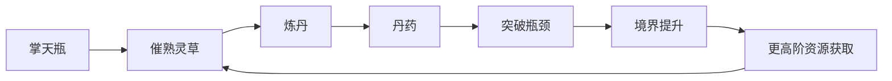

# 炼丹体系

炼丹是韩立突破资质限制的核心技艺之一。掌天瓶提供灵草，炼丹把灵草转化为修为、突破概率、疗伤、延寿和灵兽培养资源。

## 丹药用途

- 提升修为。
- 突破瓶颈。
- 恢复法力。
- 延寿。
- 疗伤。
- 稳定神魂。
- 培育灵兽。
- 辅助法体或秘术修炼。

## 典型丹药

| 阶段 | 丹药 | 作用 |
|---|---|---|
| 炼气/筑基 | 黄龙丹、金髓丸 | 低阶增进修为 |
| 炼气/筑基 | 筑基丹 | 突破筑基瓶颈，主材料包括玉髓芝、紫猴花、天灵果 |
| 筑基 | 合气丹、真元丹、聚灵丹 | 筑基期增进修为 |
| 结丹 | 降尘丹 | 增加结丹几率 |
| 元婴 | 定灵丹/安魂丹 | 定心安魂，减轻心魔，辅助结婴 |
| 元婴 | 九曲灵参丹、培婴丹 | 增加结婴概率或壮大元婴 |
| 特殊 | 补天丹 | 弥补灵根不纯，精炼先天灵根 |
| 特殊 | 造化丹 | 体验境界，对突破有奇效 |
| 高阶 | 腾龙丹、虚灵丹/太虚妙灵丹 | 炼虚、合体阶段增进修为与突破 |

## 掌天瓶与炼丹闭环

## 丹药筛选字段

| 字段 | 说明 |
|---|---|
| 适用境界 | 炼气、筑基、结丹、元婴、炼虚、合体等。 |
| 用途 | 增进修为、突破瓶颈、疗伤、延寿、稳固神魂、培育灵兽。 |
| 材料 | 原著明确材料优先，常见丹方配比单独标注资料层级。 |
| 来源 | 原著章节、公开百科、读者整理或游戏化扩展。 |
| 资料层级 | 原著明确进入正文，读者扩展或配比细节进入待复核。 |
