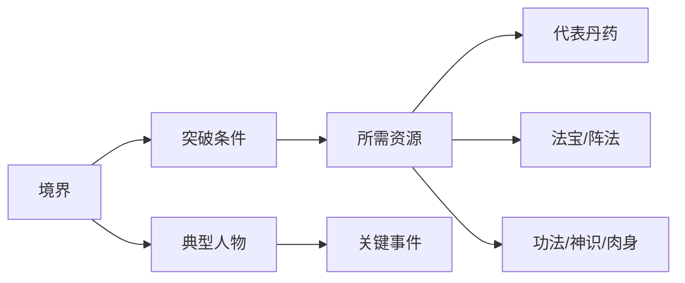

# 修行规则与资源

凡人体系的现实感来自一套持续约束修士的规则：寿元有限、天劫逼近、夺舍受限、资源稀缺、功法有门槛，任何突破都需要代价。

## 寿元体系

常见读者整理中的近似寿元：炼气期与凡人差距有限，筑基约二百年，结丹约四五百年，元婴约千年，化神约两千年。炼虚、合体、大乘寿元大幅增加，但需面对周期性天劫与飞升压力。

> 寿元数值受功法、丹药、种族、法体、天劫影响，只作为近似阅读参考，并按来源与置信度分层。

## 天劫体系

| 劫难 | 出现场景 | 作用 |
|---|---|---|
| 雷劫 | 突破境界、飞升、妖兽进阶 | 检验修为与法体承受力 |
| 小天劫/大天劫 | 灵界高阶修士周期压力 | 约束长生，迫使修士不断寻找资源 |
| 飞升之劫 | 大乘/渡劫进入仙界 | 跨界门槛 |
| 丹劫 | 高阶丹药、道丹、仙丹成丹 | 体现丹药层级和天地规则反应 |
| 真仙三衰/衰劫 | 仙界修士 | 仙界长生并非无代价 |

韩立常通过法宝、肉身、灵宠、阵法、丹药等多重手段渡劫。

## 夺舍铁则

公开设定资料中常见三大铁则：

1. 修仙者不可对凡人进行夺舍，否则凡人肉身承受不住，会自行崩溃。
2. 通常只有法力高者夺舍法力低者才更可能成功，法力差距越大越安全。
3. 一名修仙者一生通常只能夺舍一次，第二次会导致元神无故消亡。

这三条规则对墨大夫、余子童、元婴修士、古修残魂等剧情理解非常关键。

## 突破资源

| 资源类型 | 代表 | 作用 |
|---|---|---|
| 丹药 | 筑基丹、降尘丹、定灵丹、培婴丹、造化丹 | 提升修为、突破瓶颈、稳固神魂 |
| 功法 | 青元剑诀、大衍诀、梵圣真魔功、真言化轮经 | 决定修行路线、上限与配套神通 |
| 灵地/灵脉 | 洞府、宗门灵脉、药园 | 影响修炼效率和资源产出 |
| 法宝/阵法 | 青竹蜂云剑、元合五极山、护山阵 | 提升战斗与渡劫安全 |
| 神识 | 大衍诀、炼神术 | 控制傀儡、飞剑、灵虫、阵法与斗法判断 |
| 肉身 | 明王诀、梵圣真魔功、百脉炼宝决 | 承受高阶法宝、玄天之宝和近战压制 |
| 法则 | 时间、空间、轮回、混沌 | 仙界篇高阶修炼核心 |

## 突破关系链

寿元、丹方和突破概率属于高冲突资料，应优先标注来源层级；原著明确内容进入正文，读者推断只作为待复核线索。
