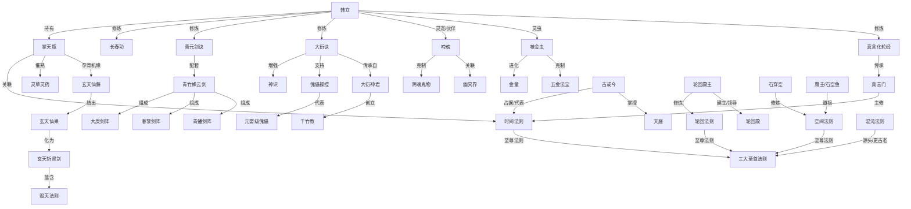

# 核心关系图谱

核心关系图谱用于把长文本拆成可视化关系，以 Mermaid 展示韩立、掌天瓶、功法、法宝、灵宠、法则与势力之间的核心关联。

## 关系边类型

- `修炼`：人物 -> 功法。
- `持有`：人物 -> 法宝。
- `所属`：人物 -> 势力。
- `位于`：地域 -> 界面。
- `克制`：功法/法宝/灵兽 -> 对象。
- `材料`：法宝/丹药 -> 材料。
- `进阶为`：境界/灵兽/法宝 -> 高阶形态。
- `传承自`：功法/技艺 -> 创始人/宗门。
- `对应`：妖兽等级 -> 修士境界。
