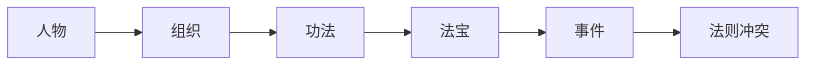

# 三大至尊法则

时间、空间、轮回是仙界篇最重要的三大至尊法则。它们不仅是能力体系，也是组织冲突、人物因果和终局大战的核心。

## 时间法则

时间法则是韩立仙界篇主线核心。

| 关联 | 内容 |
|---|---|
| 核心宝物 | 掌天瓶 |
| 传承势力 | 真言门 |
| 代表功法 | 真言化轮经、水衍四时诀、东乙枯荣经、断时流火集、幻辰宝典 |
| 代表人物 | 韩立、古或今、弥罗老祖、轮回殿主相关因果 |
| 能力方向 | 时间减速、时间停滞、光阴之丝、四时枯荣、时间道纹 |

## 空间法则

空间法则涉及跨界、传送、空间裂缝、魔域、积鳞空境和空间道祖线。

| 关联 | 内容 |
|---|---|
| 代表人物 | 石穿空、魔主/石空鱼、蟹道人/石空解 |
| 代表器物 | 逆星盘、破天锤、空间节点、古传送阵 |
| 能力方向 | 跨界传送、空间漩涡、空间裂缝、空间禁锢、界面穿梭 |

## 轮回法则

轮回法则与轮回殿、轮回殿主、南宫婉功法线索、幽冥界和韩立多重因果相关。

| 关联 | 内容 |
|---|---|
| 代表组织 | 轮回殿 |
| 代表人物 | 轮回殿主、南宫婉、蛟三/甘九真、韩立 |
| 关联地域 | 幽冥界、仙界、轮回殿支线 |
| 能力方向 | 轮回转世、神魂因果、天道轮回之力、与时间法则互补 |

## 至尊法则关系链

三大至尊法则通过人物、组织、功法、法宝和事件共同呈现：时间法则连接韩立与真言门，空间法则连接魔域与蟹道人，轮回法则连接轮回殿与南宫婉因果。
