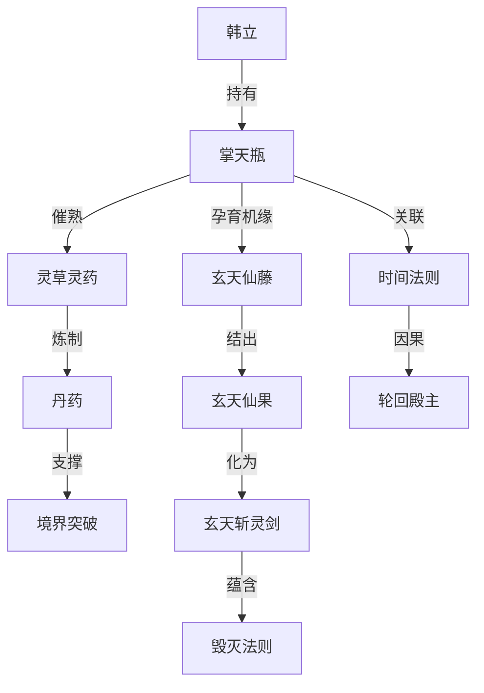

# 掌天瓶

掌天瓶是韩立最核心机缘，俗称“小绿瓶”。它不是单纯的宝物，而是贯穿灵药、丹药、玄天之宝、时间法则、轮回殿主和终局因果的核心枢纽。

## 核心作用

| 阶段 | 作用 | 影响 |
|---|---|---|
| 早期 | 催熟灵药 | 解决韩立伪灵根导致的资源瓶颈 |
| 人界 | 支撑炼丹 | 筑基、结丹、元婴等多阶段修炼资源来源 |
| 灵界 | 孕育玄天机缘 | 催生玄天仙藤、玄天仙果、玄天斩灵剑线索 |
| 仙界 | 时间法则本源 | 与瓶灵、轮回殿主、时间法则因果深度绑定 |

## 关联实体

## 叙事价值

掌天瓶使韩立的成长逻辑具有可解释性：他不是资质天才，而是通过稳定获取灵草、炼制丹药、积累资源，逐步抵消伪灵根缺陷。后期掌天瓶又从资源工具升级为法则与本源谜题，使早期“小瓶催熟”的设定与仙界篇终局相连。

## 能力阶段表

| 阶段 | 能力表现 | 关联实体 | 剧情影响 |
|---|---|---|---|
| 人界早期 | 小绿瓶凝液、催熟灵草 | 韩立、灵草、筑基丹 | 弥补伪灵根资源瓶颈 |
| 人界中后期 | 稳定支撑炼丹和高阶灵药积累 | 丹药、虚天鼎、九曲灵参 | 推动结丹、元婴和化神成长 |
| 灵界阶段 | 牵引玄天仙藤、玄天仙果与玄天斩灵剑线索 | 玄天仙藤、玄天斩灵剑 | 将资源工具升级为玄天之宝因果 |
| 仙界阶段 | 显露时间法则本源与瓶灵因果 | 时间法则、轮回殿主、古或今 | 进入终局道祖冲突核心 |

## 关键事件时间线

| 阶段 | 事件 | 影响 |
|---|---|---|
| 七玄门后 | 韩立获得神秘小瓶 | 修仙路线从凡人江湖转向资源型逆袭 |
| 黄枫谷与乱星海 | 催熟灵草并炼丹 | 稳定跨越筑基、结丹、元婴瓶颈 |
| 灵界 | 与玄天机缘产生关联 | 连接玄天之宝与毁灭法则线索 |
| 仙界 | 掌天瓶与时间本源揭示 | 牵动轮回殿主、古或今和时间道祖之争 |
