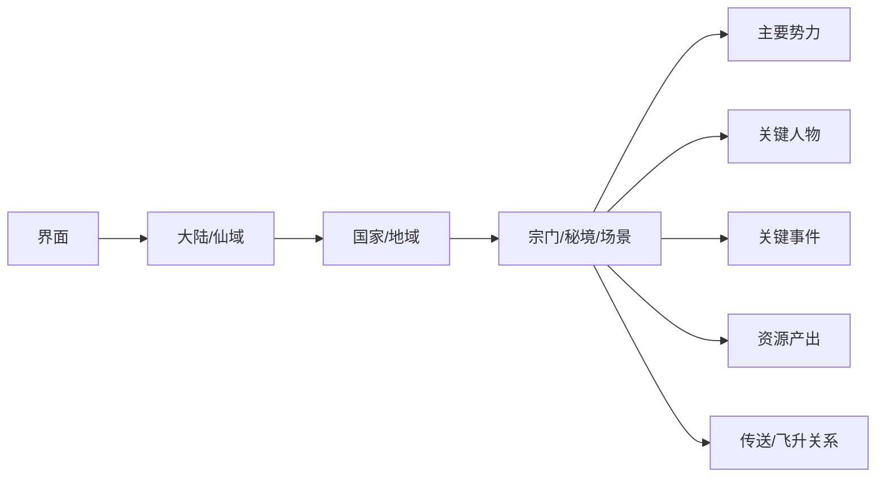

# 世界观总览

《凡人修仙传》的世界不是单纯的等级地图，而是由“资源稀缺、界面限制、势力利益、个人机缘”共同驱动的修仙宇宙。凡人与修仙者共存，但修仙资格由灵根决定；低阶修士依附宗门、家族、坊市和秘境资源，高阶修士则不断突破界面限制，向灵界、仙界迈进。

## 核心结构

| 层级 | 代表舞台 | 主导矛盾 | 典型资源 |
|---|---|---|---|
| 人界 | 天南、乱星海、大晋、极西、草原 | 灵气贫乏、宗门争夺、飞升困难 | 筑基丹、妖丹、古修遗迹、传送阵、通天灵宝 |
| 灵界 | 风元大陆、蛮荒、雷鸣大陆、魔界 | 族群战争、真灵血脉、玄天之宝争夺 | 玄天之宝、真灵血脉、广寒界、冥河神乳 |
| 仙界 | 北寒仙域、天庭、轮回殿、真言门、灰界、魔域 | 法则归属、道祖格局、天庭秩序 | 法则功法、仙器、道丹、掌天瓶本源 |

## 世界运行逻辑

- **资质不是终点**：灵根决定起点，但资源、功法、神识、肉身、法宝和机缘共同决定上限。
- **界面会限制强者**：人界灵气不足，化神后难以继续修炼；灵界大乘面对大天劫与飞升压力；仙界高阶修士受法则与道祖格局制衡。
- **势力按利益行事**：正道、魔道、妖族、异族、仙宫、天庭和轮回殿并非简单善恶划分，更多体现资源争夺与生存策略。
- **机缘总伴随杀劫**：血色禁地、虚天殿、昆吾山、广寒界、冥寒仙府等秘境都以高风险换取高收益。

## 页面导航

- [人界地域](/docs/world/human-world)：韩立修仙起点与主要宗门格局。
- [灵界地域](/docs/world/spirit-world)：飞升后的族群世界与玄天之宝争夺。
- [仙界地域](/docs/world/immortal-world)：法则、天庭、轮回殿与道祖冲突。
- [势力索引](/docs/world/factions)：按界面与类型梳理宗门、族群、组织和敌对关系。

## 世界实体层级

世界观页面按界面、地域、势力、人物、事件、资源与跨界通道组织，便于从阅读入口跳转到具体专题。
